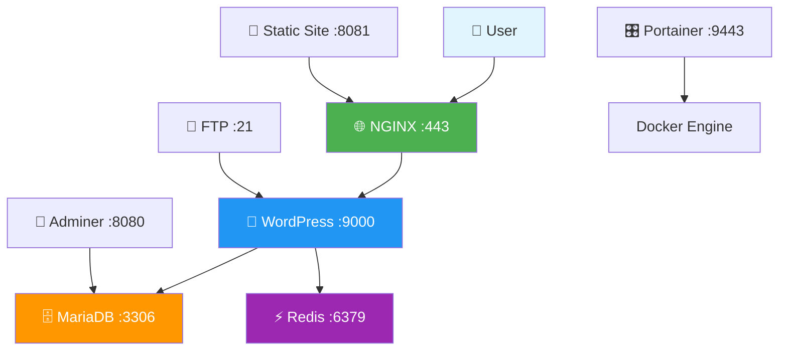
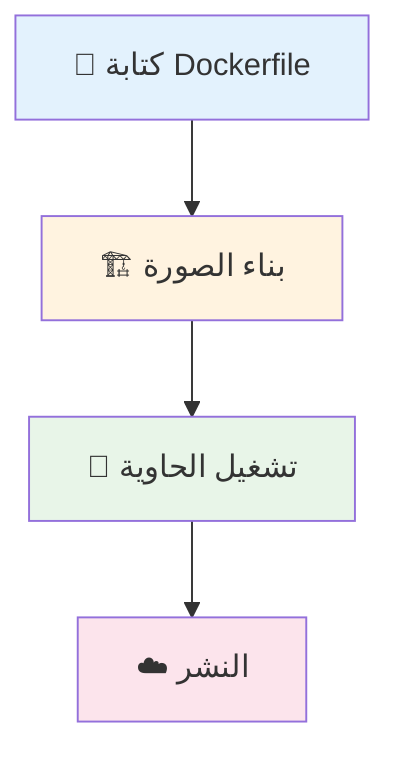

# Inception - Docker Infrastructure Project

<div align="center">
  
  
  <h3>🚀 Building the Future of Containerized Applications</h3>
  
  <p>
    
    
    
    
  </p>
</div>

---

<div align="center">
  <h2>⚡ Quick Start Animation</h2>
  
  <details>
    <summary>🎬 Click to see the setup steps!</summary>
    
<div align="center">
  <div style="font-family: 'Courier New', monospace; background: #1e1e1e; color: #00ff00; padding: 20px; border-radius: 10px; margin: 10px 0;">
    <div># Building your infrastructure...</div>
  </div>
  
</div>

<div align="center">
  <div style="font-family: 'Courier New', monospace; background: #1e1e1e; color: #00ff00; padding: 20px; border-radius: 10px; margin: 10px 0;">
    <div># Starting services...</div>
  </div>
  
</div>

<div align="center">
  <div style="font-family: 'Courier New', monospace; background: #1e1e1e; color: #00ff00; padding: 20px; border-radius: 10px; margin: 10px 0;">
    <div># Your site is live! Visit: https://melmehdi.42.fr</div>
  </div>
</div>

  </details>
</div>

---

## 📋 Table of Contents
- [Overview](#overview)
- [Architecture](#architecture)
- [Services](#services)
- [Prerequisites](#prerequisites)
- [Installation](#installation)
- [Usage](#usage)
- [Configuration](#configuration)
- [Troubleshooting](#troubleshooting)
- [Docker Concepts](#docker-concepts)
- [Project Guide](#project-guide)

## 🏗️ Overview

This project implements a complete web infrastructure using Docker containers. It includes:
- **Core Services**: NGINX (reverse proxy), WordPress (CMS), MariaDB (database)
- **Bonus Services**: Redis (cache), FTP server, Adminer (DB admin), Portainer (container management), Static website

All services run in isolated Docker containers and communicate through a custom network.

## 🏛️ Architecture

<div align="center">
  <h3>🌐 Live Network Flow Animation</h3>
  
  <details>
    <summary>🎭 Click to see the network in action!</summary>
    
<div align="center">
  
</div>



<div align="center" style="margin-top: 20px;">
  <div style="display: inline-block; background: linear-gradient(45deg, #667eea, #764ba2); color: white; padding: 15px 25px; border-radius: 25px;">
    <span style="font-size: 1.2em; font-weight: bold;">🔄 Network Active</span>
  </div>
</div>

  </details>
</div>

```
┌─────────────────────────────────────────────────────────────┐
│                    Docker Network                           │
│                  (inception_network)                        │
│                                                             │
│  ┌─────────┐    ┌──────────┐    ┌─────────┐                 │
│  │  NGINX  │◄──►│WordPress │◄──►│ MariaDB │                 │
│  │  :443   │    │   :9000  │    │  :3306  │                 │
│  └─────────┘    └──────┬───┘    └─────────┘                 │
│                        │                                    │
│                        ▼                                    │
│                    ┌─────────┐                              │
│                    │  Redis  │                              │
│                    │  :6379  │                              │
│                    └─────────┘                              │
│                                                             │
│  ┌─────────┐    ┌─────────┐    ┌──────────┐                 │
│  │   FTP   │    │Adminer  │    │Portainer │                 │
│  │ :21,... │    │  :8080  │    │  :9443   │                 │
│  └─────────┘    └─────────┘    └──────────┘                 │
│                                                             │
│                    ┌────────────┐                           │
│                    │Static Site │                           │
│                    │   :8081    │                           │
│                    └────────────┘                           │
└─────────────────────────────────────────────────────────────┘
```

## 🚀 Services

### Core Services

#### 1. NGINX
- **Port**: 443 (HTTPS)
- **Purpose**: Reverse proxy and web server
- **Features**:
  - SSL/TLS encryption
  - Static file serving
  - Load balancing
  - Security headers

#### 2. WordPress + PHP-FPM
- **Port**: 9000 (internal)
- **Purpose**: Content Management System
- **Features**:
  - PHP processing
  - MySQL database connection
  - User authentication
  - Content management

#### 3. MariaDB
- **Port**: 3306 (internal)
- **Purpose**: Database server
- **Features**:
  - MySQL compatible
  - Data persistence
  - User management
  - Secure connections

### Service Status Overview
- 🟢 **NGINX**: Active on port 443
- 🟢 **WordPress**: Active on port 9000
- 🟢 **MariaDB**: Active on port 3306

### Bonus Services

#### 4. Redis
- **Port**: 6379 (internal)
- **Purpose**: Caching layer for WordPress
- **Features**:
  - Password authentication
  - Persistent data storage
  - AOF and RDB persistence

#### 5. FTP Server
- **Ports**: 21, 21000-21010make
- **Purpose**: File transfer access to WordPress files
- **Features**:
  - VSFTPD server
  - Passive mode support
  - User authentication

#### 6. Adminer
- **Port**: 8080
- **Purpose**: Database administration web interface
- **Features**:
  - Web-based MySQL/MariaDB management
  - Direct connection to MariaDB container

#### 7. Portainer
- **Port**: 9443 (HTTPS)
- **Purpose**: Docker container management
- **Features**:
  - Web-based Docker management
  - Container monitoring
  - SSL enabled

#### 8. Static Website
- **Port**: 8081
- **Purpose**: Simple static website showcase
- **Features**:
  - NGINX server
  - Custom HTML/CSS content

## 🔧 Prerequisites

- Docker Engine (v20.10+)
- Docker Compose (v2.0+)
- Make utility
- Minimum 4GB RAM
- 10GB free disk space

## 📥 Installation

### Quick Setup Steps

1. **Clone the repository**
   ```bash
   git clone <repository-url> && cd inception
   ```

2. **Setup environment**
   ```bash
   # Copy environment template
   cp srcs/.env.example srcs/.env
   # Edit .env with your configuration
   ```

3. **Create required directories**
   ```bash
   make
   ```

4. **Build and start services**
   ```bash
   make
   ```

### Alternative Commands

```bash
# Build images only
make build

# Start containers only
make up

# View logs
make logs

# Stop services
make down
```

## 🚀 Usage

### Starting Services
```bash
# Build and start all containers
make

# Or use individual commands
make build    # Build images only
make up       # Start containers only
```

### Stopping Services
```bash
make down     # Stop containers
make clean    # Remove containers, images, and volumes
make fclean   # Complete cleanup including data
```

### Accessing Services

- **Main Website**: https://melmehdi.42.fr (requires hosts file entry)
- **Adminer**: http://localhost:8080
- **Portainer**: https://localhost:9443
- **Static Site**: http://localhost:8081
- **FTP**: ftp://localhost:21

### Adding Domain to Hosts File
```bash
# Add this line to /etc/hosts (Linux/Mac) or C:\Windows\System32\drivers\etc\hosts (Windows)
127.0.0.1 melmehdi.42.fr
```

### Default Credentials

**WordPress Admin**:
- Username: `melmehdi`
- Password: `admin_password123`
- Email: `melmehdi@student.42.fr`

**WordPress User**:
- Username: `wp_user`
- Password: `wp_user`
- Email: `user@student.42.fr`

**Database (via Adminer)**:
- Server: `mariadb`
- Username: `wp_user`
- Password: `wordpress_user_password123`
- Database: `wordpress`

**FTP**:
- Username: `ftp_user`
- Password: `ftppassword123`
- Server: `localhost:21`
- Access: `ftp://localhost:21`

## ⚙️ Configuration

### Environment Variables
Edit `srcs/.env` to customize:
```bash
DOMAIN_NAME=your-domain.com
MYSQL_DATABASE=your_db_name
WP_ADMIN_USER=your_admin
# ... other variables
```
ftp localhost 21
# Then enter: ftp_user / ftppassword123

### Secrets Management
Passwords are stored in `secrets/` directory:
- `db_root_password.txt` - MariaDB root password
- `db_password.txt` - WordPress database password
- `credentials.txt` - Additional credentials

### Volume Persistence
Data is persisted in `/home/melmehdi/data/`:
- `mariadb/` - Database files
- `wordpress/` - WordPress files
- `redis/` - Redis data

## 🐛 Troubleshooting

### Common Issues

1. **Permission Denied**:
   ```bash
   sudo chown -R $USER:$USER /home/melmehdi/data/
   ```

2. **Domain Not Resolving**:
   - Add `127.0.0.1 melmehdi.42.fr` to `/etc/hosts`

3. **Containers Not Starting**:
   ```bash
   docker logs <container-name>
   make down && make
   ```

4. **Database Connection Issues**:
   - Ensure MariaDB container is running
   - Check database credentials in secrets files

5. **Redis Connection Issues**:
   - Verify Redis container is running
   - Check Redis password configuration

6. **FTP/WordPress File Upload Issues**:
   ```bash
   # If you get "Unable to locate WordPress content directory" error
   docker exec wordpress bash -c "cd /var/www/html && wp config set FS_METHOD direct --allow-root"
   docker exec wordpress chown -R www-data:www-data /var/www/html
   docker restart wordpress
   ```

### Useful Commands

```bash
# View running containers
docker ps

# Check container logs
docker logs <container-name>

# Access container shell
docker exec -it <container-name> bash

# Monitor resources
docker stats

# View networks
docker network ls

# Inspect volumes
docker volume ls
```

### Health Checks

```bash
# Test NGINX
curl -k https://melmehdi.42.fr

# Test WordPress (should redirect to setup)
curl -k https://melmehdi.42.fr/wp-admin

# Test database connection
docker exec -it mariadb mysql -u wp_user -p wordpress

# Test Redis
docker exec -it redis redis-cli ping
```

## 📁 Project Structure

```
inc/
├── Makefile                 # Build automation
└── srcs/
    ├── .env                 # Environment variables
    ├── docker-compose.yml   # Container orchestration
    └── requirements/
        ├── mariadb/         # Database service
        ├── nginx/           # Web server
        ├── wordpress/       # CMS service
        └── bonus/
            ├── adminer/     # DB admin tool
            ├── ftp/         # File transfer
            ├── portainer/   # Container management
            ├── redis/       # Caching service
            └── static-site/ # Static website
```

## 🔒 Security Features

- HTTPS-only access with SSL certificates
- Database password protection via Docker secrets
- Isolated container network
- Non-root user execution where possible
- Security headers in NGINX configuration
- Redis password authentication

## 🎯 Learning Objectives

This project demonstrates:
- Docker containerization
- Multi-service architecture
- Network isolation and communication
- Volume management and data persistence
- Service orchestration with Docker Compose
- SSL/TLS configuration
- Database management
- Caching strategies
- Web server configuration

---

**Note**: This is an educational project for learning Docker and infrastructure management. For production use, additional security measures and monitoring should be implemented.

# 🐳 الفرق بين Container و Image

<div align="center">
  <h2>🎭 Animated Docker Concepts</h2>
  
  <details>
    <summary>🎬 Click to see Docker magic in action!</summary>
    
<div align="center">
  
</div>

<div align="center" style="margin: 30px 0;">
  <div style="display: inline-block;">
    <div style="background: linear-gradient(45deg, #FF6B6B, #4ECDC4); color: white; padding: 20px; border-radius: 15px; box-shadow: 0 10px 30px rgba(0,0,0,0.2);">
      <h3 style="margin: 0;">🐳 Docker World</h3>
    </div>
  </div>
</div>

  </details>
</div>

## المقارنة الأساسية

<div align="center">
  <table style="border-collapse: collapse;">
    <tr>
      <td align="center" style="padding: 20px;">
        <div style="background: linear-gradient(135deg, #667eea, #764ba2); color: white; padding: 30px; border-radius: 20px; box-shadow: 0 15px 35px rgba(0,0,0,0.1);">
          <h3>📦 Docker Image</h3>
          
          <p><strong>الصورة = القالب الثابت</strong></p>
          <ul align="right" style="list-style: none; padding: 0;">
            <li>🔒 للقراءة فقط</li>
            <li>💾 مخزنة على القرص</li>
            <li>🏗️ أساس بناء الحاويات</li>
            <li>🌐 قابلة للمشاركة</li>
          </ul>
        </div>
      </td>
      <td align="center" style="padding: 20px;">
        <div style="background: linear-gradient(135deg, #f093fb, #f5576c); color: white; padding: 30px; border-radius: 20px; box-shadow: 0 15px 35px rgba(0,0,0,0.1);">
          <h3>🏃 Docker Container</h3>
          
          <p><strong>الحاوية = التطبيق يعمل فعلياً</strong></p>
          <ul align="right" style="list-style: none; padding: 0;">
            <li>🔄 قيد التشغيل</li>
            <li>💭 تستهلك ذاكرة</li>
            <li>✏️ قابلة للتعديل</li>
            <li>⏰ لها دورة حياة</li>
          </ul>
        </div>
      </td>
    </tr>
  </table>
</div>

## 🍳 تشبيه كتاب الطبخ

| كتاب الطبخ (Docker Image) | ➡️ | الطبق المطبوخ (Docker Container) |
|---------------------------|-----|----------------------------------|
| 📖 وصفات مكتوبة          |     | 🔥 نتيجة تطبيق الوصفة          |
| 🔒 لا تتغير              |     | 🍴 قابل للاستهلاك              |
| 📤 يمكن مشاركتها         |     | 🔄 يمكن تكراره                 |

## ⚙️ من الصورة إلى الحاوية

1. 📦 **لديك صورة** - قالب ثابت جاهز للاستخدام
   ```
   nginx:latest
   ```

2. 🔨 **تشغل أمر** - تحول الصورة إلى حاوية
   ```bash
   docker run nginx
   ```

3. ✨ **حاوية تعمل** - التطبيق أصبح نشطاً
   - 🌐 موقع ويب يعمل

## 🔢 صورة واحدة ← عدة حاويات

**صورة واحدة:** nginx:latest

**تتحول إلى عدة حاويات:**
- 🌐 حاوية 1: موقع شركة
- 🛒 حاوية 2: متجر إلكتروني
- 📱 حاوية 3: تطبيق API

**✨ المعنى:** من صورة واحدة يمكن إنشاء حاويات متعددة تعمل بشكل منفصل!

## 🔍 الفروق الرئيسية

### Docker Image
- 🔒 ثابتة وغير قابلة للتغيير
- 💾 مخزنة على القرص الصلب
- 📋 تحتوي على التعليمات فقط
- ⚡ لا تستهلك معالج أو ذاكرة
- 🏗️ أساس لإنشاء الحاويات

### Docker Container
- 🔄 نشطة ومتغيرة
- 💭 تستخدم الذاكرة والمعالج
- 🎯 التطبيق يعمل فعلياً
- ⏰ لها دورة حياة (بداية ونهاية)
- ✏️ يمكن التفاعل معها وتعديلها

## 💡 مثال عملي: تطبيق ويب

**الصورة:**
- 🐧 Ubuntu Linux
- 🔧 Node.js
- 📁 كود التطبيق
- 🔌 المكتبات
- حجم: 200MB على القرص

**الحاوية:**
- 🔄 التطبيق يعمل
- 🌐 Port: 3000
- 💭 يستخدم 50MB ذاكرة
- 🔧 يمكن التحكم به
- الحالة: 🟢 نشط

## 💻 أوامر عملية

### التعامل مع الصور
```bash
# سحب صورة
docker pull nginx

# عرض الصور
docker images

# بناء صورة
docker build -t myapp .
```

### التعامل مع الحاويات
```bash
# تشغيل حاوية
docker run -d nginx

# عرض الحاويات النشطة
docker ps

# إيقاف حاوية
docker stop container_id
```

## 🎉 اتذكر
- 📦 **الصورة** = الخطة أو القالب
- 🏃 **الحاوية** = التطبيق يعمل من الخطة
- 💡 صورة واحدة ← عدة حاويات

# 🐳 شرح Docker بالصور والمخططات

## 🔄 مقارنة الطريقة التقليدية مع Docker

### ❌ الطريقة التقليدية
**المشاكل:**
- استهلاك عالي للذاكرة
- بطء في الإقلاع
- تعقيد في الإدارة

```
Hardware
├── نظام التشغيل المضيف
├── Virtual Machine 1
│   ├── Guest OS 1
│   └── التطبيق 1
```

### ✅ طريقة Docker
**المميزات:**
- استهلاك أقل للموارد
- إقلاع سريع
- إدارة مبسطة

```
Hardware
├── نظام التشغيل المضيف
├── Docker Engine
├── Container 1
│   └── التطبيق 1
```

## 🏗️ معمارية Docker

### Virtual Machines
```
Hypervisor
├── Guest OS ── App A
└── Guest OS ── App B
Host Operating System
Infrastructure
```

### Docker Containers
```
Container A
Container B
Docker Engine
Host Operating System
Infrastructure
```

## ⚙️ سير عمل Docker

<div align="center">
  <h3>🔄 Docker Workflow Animation</h3>
  
  <details>
    <summary>🎬 Click to see the workflow steps!</summary>
    
<div align="center">
  <div style="position: relative; width: 100%; max-width: 800px; margin: 30px 0;">
    <!-- Workflow Steps -->
    <div style="display: flex; justify-content: space-between; align-items: center; margin-bottom: 50px;">
      
      <div style="text-align: center;">
        <div style="width: 80px; height: 80px; background: linear-gradient(45deg, #667eea, #764ba2); border-radius: 50%; display: flex; align-items: center; justify-content: center; margin: 0 auto 15px; box-shadow: 0 10px 30px rgba(0,0,0,0.2);">
          <span style="font-size: 2em;">📝</span>
        </div>
        <div style="background: #667eea; color: white; padding: 10px 20px; border-radius: 20px;">
          Dockerfile
        </div>
      </div>
      
      <div style="width: 100px; height: 4px; background: linear-gradient(90deg, #667eea, #764ba2);"></div>
      
      <div style="text-align: center;">
        <div style="width: 80px; height: 80px; background: linear-gradient(45deg, #f093fb, #f5576c); border-radius: 50%; display: flex; align-items: center; justify-content: center; margin: 0 auto 15px; box-shadow: 0 10px 30px rgba(0,0,0,0.2);">
          <span style="font-size: 2em;">🏗️</span>
        </div>
        <div style="background: #f093fb; color: white; padding: 10px 20px; border-radius: 20px;">
          Build Image
        </div>
      </div>
      
      <div style="width: 100px; height: 4px; background: linear-gradient(90deg, #f093fb, #f5576c);"></div>
      
      <div style="text-align: center;">
        <div style="width: 80px; height: 80px; background: linear-gradient(45deg, #4facfe, #00f2fe); border-radius: 50%; display: flex; align-items: center; justify-content: center; margin: 0 auto 15px; box-shadow: 0 10px 30px rgba(0,0,0,0.2);">
          <span style="font-size: 2em;">🚀</span>
        </div>
        <div style="background: #4facfe; color: white; padding: 10px 20px; border-radius: 20px;">
          Run Container
        </div>
      </div>
      
      <div style="width: 100px; height: 4px; background: linear-gradient(90deg, #4facfe, #00f2fe);"></div>
      
      <div style="text-align: center;">
        <div style="width: 80px; height: 80px; background: linear-gradient(45deg, #43e97b, #38f9d7); border-radius: 50%; display: flex; align-items: center; justify-content: center; margin: 0 auto 15px; box-shadow: 0 10px 30px rgba(0,0,0,0.2);">
          <span style="font-size: 2em;">☁️</span>
        </div>
        <div style="background: #43e97b; color: white; padding: 10px 20px; border-radius: 20px;">
          Deploy
        </div>
      </div>
      
    </div>
    
    <!-- Progress Counter -->
    <div style="text-align: center; margin-top: 30px;">
      <div style="font-size: 2em; font-weight: bold; color: #667eea;">
        100%
      </div>
      <div style="width: 100%; height: 10px; background: #f0f0f0; border-radius: 5px; overflow: hidden;">
        <div style="height: 100%; background: linear-gradient(90deg, #667eea, #764ba2, #f093fb, #f5576c, #4facfe, #00f2fe, #43e97b, #38f9d7);"></div>
      </div>
    </div>
  </div>
  
  
</div>



### Progress Through Workflow:
<div align="center">
  
  
  
  
</div>
}
</style>

  </details>
</div>

1. 📝 **كتابة Dockerfile** - تعريف بيئة التطبيق والاعتمادات
2. 🏗️ **بناء الصورة** - `docker build -t myapp .`
3. 🚀 **تشغيل الحاوية** - `docker run myapp`
4. ☁️ **النشر** - رفع للسحابة أو خوادم أخرى

## 🎯 المفاهيم الأساسية المصورة

<div align="center">
  <h3>🌟 Interactive Docker Concepts</h3>
  
  <details>
    <summary>🎭 Click to explore Docker concepts!</summary>
    
<div align="center">
  
</div>

### 📦 Docker Image (الصورة)
<div align="center">
  
</div>
قالب للقراءة فقط يحتوي على كل ما يحتاجه التطبيق:
- 🐧 نظام التشغيل الأساسي
- 📚 المكتبات والتبعيات
- 💻 كود التطبيق
- ⚙️ إعدادات البيئة

### 🏃 Docker Container (الحاوية)
<div align="center">
  
</div>
نسخة تشغيل حية من الصورة:
- 🔄 التطبيق يعمل هنا
- 📁 نظام ملفات معزول
- 🌐 شبكة معزولة

  </details>
</div>

## 🚀 الفوائد الرئيسية

- 🎯 **قابلية النقل** - يعمل في أي مكان بنفس الطريقة
- ⚡ **السرعة** - إقلاع سريع وأداء عالي
- 🛡️ **العزل** - كل تطبيق في بيئة منفصلة
- 💰 **توفير الموارد** - استهلاك أقل للذاكرة والمعالج

## 📊 مقارنة سريعة: Containers vs Virtual Machines

| المعيار | Docker Containers | Virtual Machines |
|---------|-------------------|------------------|
| وقت الإقلاع | ثوانٍ | دقائق |
| استهلاك الذاكرة | منخفض (MBs) | عالي (GBs) |
| نظام التشغيل | مشارك | منفصل لكل VM |
| الأمان | عزل على مستوى العملية | عزل كامل |

## 💻 الأوامر الأساسية

```bash
# تشغيل حاوية جديدة
docker run -d --name myapp nginx

# عرض الحاويات النشطة
docker ps

# بناء صورة من Dockerfile
docker build -t myimage:latest .

# إيقاف حاوية
docker stop myapp

# حذف حاوية
docker rm myapp

# عرض الصور المحلية
docker images

# سحب صورة من Docker Hub
docker pull ubuntu:20.04
```

## 🔄 دورة حياة Docker

📝 **Dockerfile** → 📦 **Docker Image** → 🏃 **Container**

## 🌟 حالات الاستخدام الشائعة

- 🔧 **تطوير التطبيقات** - بيئة موحدة لجميع المطورين
- ☁️ **النشر السحابي** - نشر سهل وسريع للتطبيقات
- 🧪 **الاختبار** - اختبار في بيئات مختلفة بسهولة
- ⚖️ **التوسع** - زيادة عدد الحاويات حسب الطلب

## 💡 مثال عملي: تشغيل موقع ويب

📁 مجلد المشروع → 🔨 **بناء الصورة** → ▶️ **تشغيل الموقع**

```bash
# إنشاء Dockerfile
FROM nginx:alpine
COPY index.html /usr/share/nginx/html/

# بناء الصورة
docker build -t my-website .

# تشغيل الموقع
docker run -p 8080:80 my-website
```

## 🎉 الخلاصة
Docker يجعل تطوير ونشر التطبيقات أسهل وأسرع وأكثر موثوقية!

# 🏗️ Inception Project Architecture Guide

## 📐 Project Architecture Overview

### Services

#### 🌐 NGINX
- **Port:** 443 (HTTPS only)
- SSL/TLS Certificate
- Reverse Proxy
- Static Files

#### 📝 WordPress + PHP-FPM
- **Port:** 9000 (internal)
- CMS System
- PHP Processing
- User Interface

#### 🗄️ MariaDB
- **Port:** 3306 (internal)
- Database Server
- Data Persistence
- WordPress Backend

## 🔗 Network Flow

👤 **User** → 🌐 **NGINX** (Port 443) → 📝 **WordPress** (PHP Processing) → 🗄️ **MariaDB** (Database Query)

## 📋 Key Requirements

### 🐳 Docker Requirements
- Custom Dockerfiles (no pre-built images)
- Alpine or Debian base images
- No ready-made containers from DockerHub
- Each service in separate container

### 🔐 Security Requirements
- HTTPS only (port 443)
- SSL/TLS certificate
- Environment variables in .env
- No credentials in repository

### 🗂️ Structure Requirements
- srcs/ folder at repository root
- Makefile at repository root
- docker-compose.yml in srcs/
- Dockerfiles in respective directories

### 💾 Persistence Requirements
- Docker volumes for data
- WordPress files volume
- Database data volume
- Data survives container restart

## 📁 Required Directory Structure

```
inception/
├── Makefile
└── srcs/
    ├── docker-compose.yml
    ├── .env
    └── requirements/
        ├── nginx/
        │   ├── Dockerfile
        │   ├── conf/
        │   └── tools/
        ├── wordpress/
        │   ├── Dockerfile
        │   ├── conf/
        │   └── tools/
        └── mariadb/
            ├── Dockerfile
            ├── conf/
            └── tools/
```

## 💾 Volume Configuration

### 📁 WordPress Volume
`/home/[login]/data/wordpress` → `/var/www/html`

### 🗄️ MariaDB Volume
`/home/[login]/data/mariadb` → `/var/lib/mysql`

## ✅ Evaluation Checklist

- 🔍 Custom Dockerfiles for each service (no DockerHub images)
- 🔒 NGINX accessible only via HTTPS (port 443)
- 🌐 Website accessible at https://[login].42.fr
- 📝 WordPress properly configured (no installation page)
- 🗄️ MariaDB database populated and accessible
- 💾 Data persists after system reboot
- 🔗 Docker network configured (no host network or links)
- 🚫 No infinite loops or background processes in Dockerfiles

## 🎯 Learning Objectives

- Understand Docker containerization concepts
- Learn docker-compose for multi-service applications
- Implement secure web server configuration
- Practice infrastructure as code principles

## 💡 Study Resources

- 📚 Docker Documentation: Official Docker docs
- 🔧 Docker Compose Guide: Multi-container applications
- 🌐 NGINX Configuration: SSL/TLS setup
- 📝 WordPress with Docker: PHP-FPM configuration
- 🗄️ MariaDB Setup: Database initialization

---

<div align="center">
  <h2>🎉 Thank You for Exploring!</h2>
  
  <details>
    <summary>🎬 Click for a final celebration!</summary>
    
<div align="center">
  
  
  <h3>🚀 You've mastered Docker containerization!</h3>
  
  <p>
    
    
    
  </p>
  
  <div align="center">
    
  </div>
  
  <h4>🌟 Keep building amazing things with Docker! 🌟</h4>
</div>

  </details>
</div>

---

**Note**: This is an educational project for learning Docker and infrastructure management. For production use, additional security measures and monitoring should be implemented.
