# 🚀 Inception - Docker Infrastructure

<div align="center">
  

  <h3>Complete Web Infrastructure with Docker</h3>

  <p>
    
    
    
    
  </p>
</div>

---

## 📋 Quick Overview

**Inception** is a complete web infrastructure project featuring:
- **NGINX** (Reverse Proxy + SSL)
- **WordPress** (CMS with PHP-FPM)
- **MariaDB** (Database)
- **Bonus Services**: Redis, FTP, Adminer, Portainer, Static Site

All services run in isolated Docker containers with persistent data and secure networking.

## 🏗️ Architecture

```mermaid
graph TD
    A[👤 User] --> B[🌐 NGINX :443]
    B --> C[📝 WordPress :9000]
    C --> D[🗄️ MariaDB :3306]
    C --> E[⚡ Redis :6379]

    F[🔧 Adminer :8080] --> D
    G[📁 FTP :21] --> C
    H[🎛️ Portainer :9443] --> I[Docker Engine]
```



## 🚀 Quick Start

### Prerequisites
- Docker Engine 20.10+
- Docker Compose 2.0+
- Make utility
- 4GB RAM, 10GB disk space

### Installation & Setup

```bash
# 1. Clone repository
git clone <repository-url> && cd inception

# 2. Setup environment
cp srcs/.env.example srcs/.env
# Edit srcs/.env with your configuration

# 3. Build and start all services
make

# 4. Access your site
# Main site: https://melmehdi.42.fr
# Adminer: http://localhost:8080
# Portainer: https://localhost:9443
```

## 🐳 Essential Docker Commands

### Container Management
```bash
# View running containers
docker ps

# View all containers (including stopped)
docker ps -a

# Start/stop containers
docker start <container-name>
docker stop <container-name>

# Remove containers
docker rm <container-name>
docker rm $(docker ps -aq)  # Remove all
```

### Image Management
```bash
# List images
docker images

# Build image from Dockerfile
docker build -t myapp:latest .

# Remove images
docker rmi <image-id>
docker image prune  # Remove unused images
```

### Logs & Debugging
```bash
# View container logs
docker logs <container-name>

# Follow logs in real-time
docker logs -f <container-name>

# Execute commands in running container
docker exec -it <container-name> bash

# Inspect container details
docker inspect <container-name>
```

### Network & Volume Management
```bash
# List networks
docker network ls

# List volumes
docker volume ls

# Inspect network
docker network inspect <network-name>

# Clean up unused resources
docker system prune -a --volumes
```

### Docker Compose Commands
```bash
# Start services
docker-compose up -d

# Stop services
docker-compose down

# Rebuild and restart
docker-compose up --build -d

# View service logs
docker-compose logs -f

# Scale services
docker-compose up -d --scale wordpress=3
```

## 📊 Services & Ports

| Service | Port | Access URL | Purpose |
|---------|------|------------|---------|
| **NGINX** | 443 | `https://melmehdi.42.fr` | Reverse proxy + SSL |
| **WordPress** | 9000 | Internal | CMS + PHP-FPM |
| **MariaDB** | 3306 | Internal | Database |
| **Redis** | 6379 | Internal | Caching |
| **Adminer** | 8080 | `http://localhost:8080` | DB Admin |
| **Portainer** | 9443 | `https://localhost:9443` | Docker Management |
| **FTP** | 21 | `ftp://localhost:21` | File Transfer |
| **Static Site** | 8081 | `http://localhost:8081` | Demo Website |

## ⚙️ Configuration

### Environment Variables
Edit `srcs/.env`:
```bash
DOMAIN_NAME=your-domain.com
MYSQL_DATABASE=wordpress
MYSQL_USER=wp_user
MYSQL_PASSWORD=your_password
WP_ADMIN_USER=admin
WP_ADMIN_PASSWORD=admin_password
```

### Default Credentials

**WordPress Admin:**
- Username: `melmehdi`
- Password: `admin_password123`
- Email: `melmehdi@student.42.fr`

**Database (via Adminer):**
- Server: `mariadb`
- Username: `wp_user`
- Password: `wordpress_user_password123`
- Database: `wordpress`

**FTP:**
- Username: `ftp_user`
- Password: `ftppassword123`

🔧 Project Commands
# Build all services
make build

# Start all services
make up

---

<div align="center">
  <h3>🎉 Happy Dockering!</h3>
  <p>Built with ❤️ for learning Docker infrastructure</p>

  <p>
    
    
  </p>
</div>
